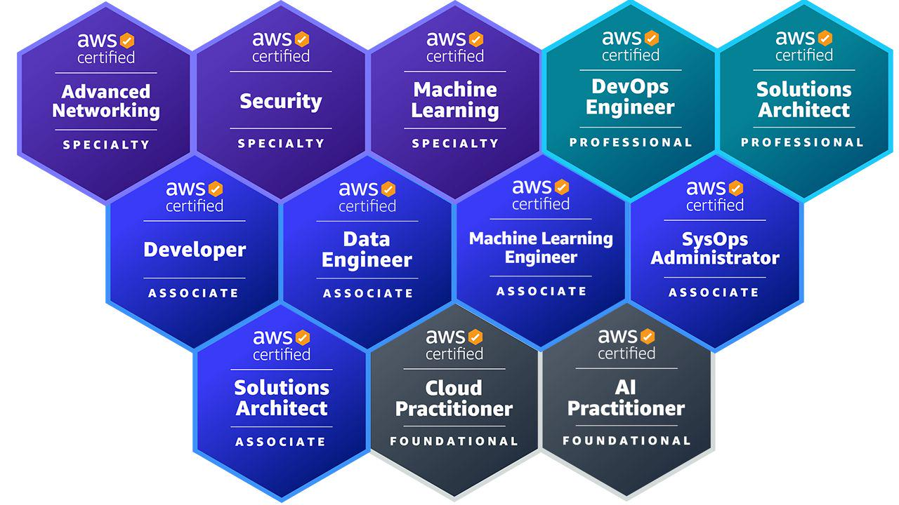

# Hi there 👋
### 🚀 About Me

#### AWS Cloud Specialist

I'm Ram Vasireddy, a AWS Cloud Specialist. My expertise -

-	Agentic AI & Multi-Agent Systems, Tools & Context Management
-	Advanced RAG, RAG Tuning, RAG Evaluation 
- LLM Evaluation, Guardrails, Fine-Tuning
- Vector Databases, Data Engineering
- LLMOps, MLOps, DataOps
- Cloud Infrastructure, DevOps, Containers, CI/CD
- Application architecture and development
- Data architecture, Network architecture, Security architecture and implementation
- Applications and Database migration, Application integration

### 🔗 Links

